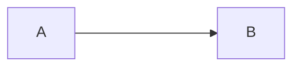

## Teste 1

- isso é um teste
- isso é outro teste

Isso é mais um teste.

Column A | Column B | Column C
---------|----------|---------
 A1 | B1 | C1
 A2 | B2 | C2
 A3 | B3 | C3

 teste de git push

 teste 2 de git push
