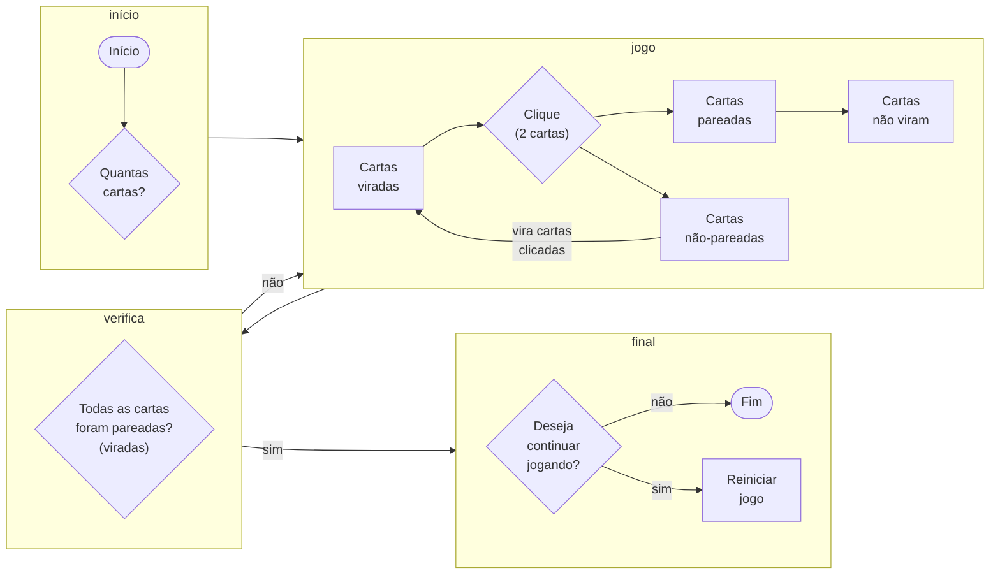

# Parrot card game

## Jogo de memória 

- Objetivo: encontrar todos os pares de parrots em X jogadas num Y tempo.
- Inicio: escolher um numero par de cartas  (entre 4 e 14) 
- O jogo: as cartas iniciam todas viradas para baixo; a cada clique, a carta vira, e o jogador pode virar outra carta; se as cartas forem iguais, elas permanecem viradas para cima; se não, elas viram para baixo; apenas duas cartas podem estar viradas para cima (além dos pares que ja foram encontrados); Cada clique configura uma jogada; Um timer é iniciado a cada rodada.
- Fim: quando todos os pares são encontrados, o jogo acaba e o timer para; o jogo exibe quantas jogadas foram realizadas e a duração da rodada. O jogador é perguntado se quer continuar jogando ou não. Se sim, o jogo volta para o início.

Isso é mais um teste.

Column A | Column B | Column C
---------|----------|---------
 A1 | B1 | C1
 A2 | B2 | C2
 A3 | B3 | C3

 teste de git push

 teste 2 de git push
